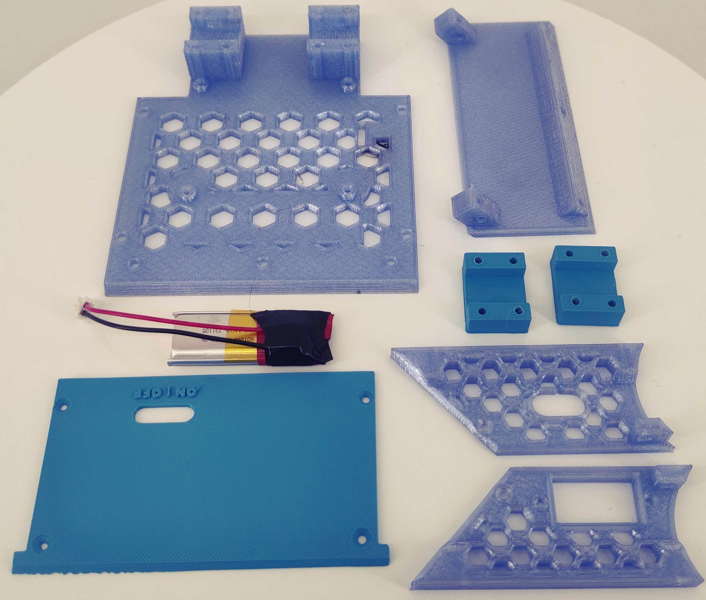
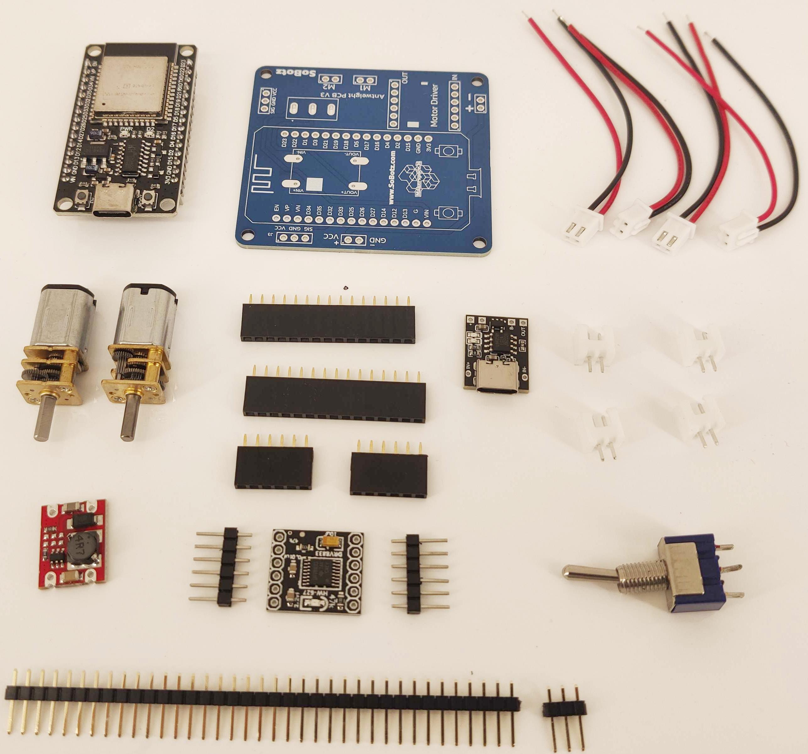
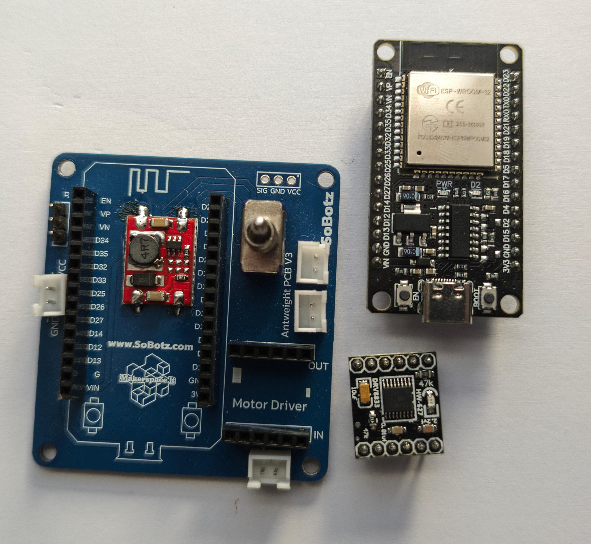
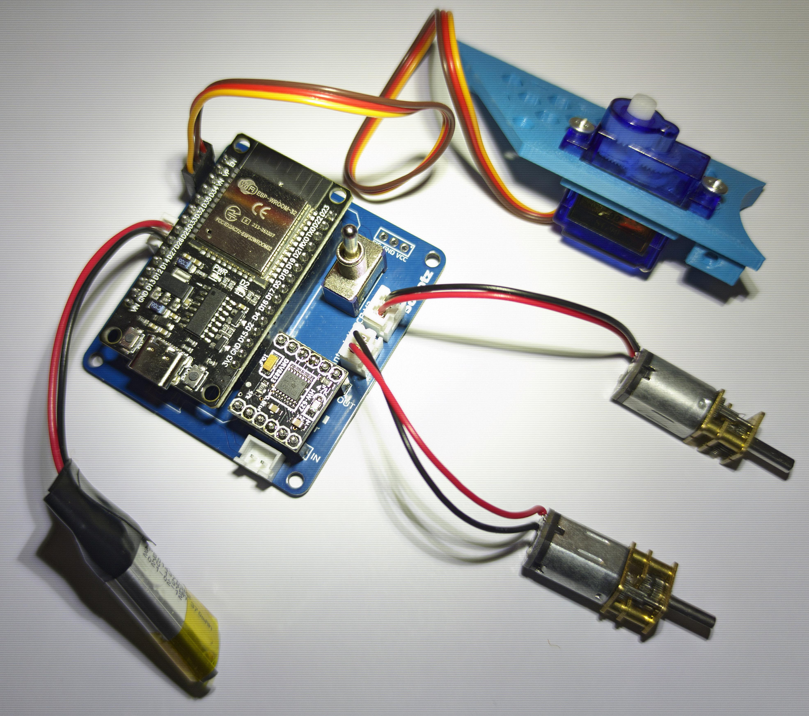
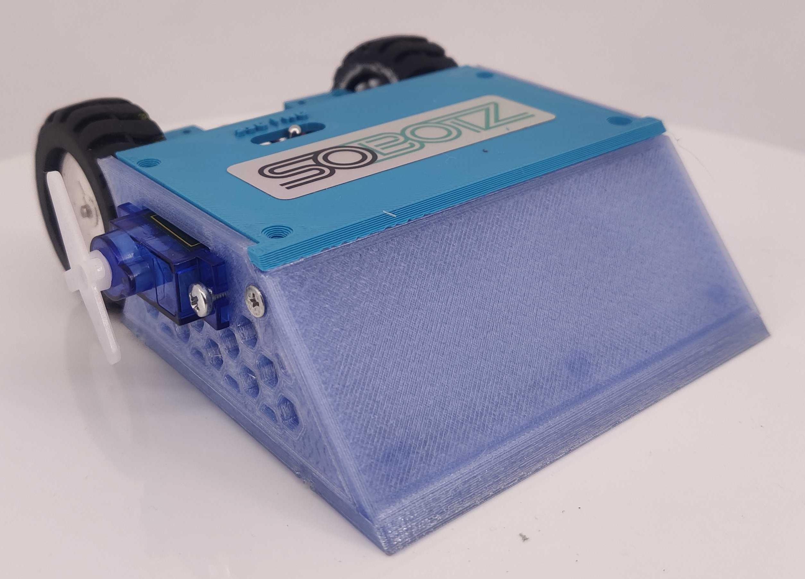

## Antweight robotukų gamybos dirbtuvės @ Kaunas Makerspace

https://github.com/makerspacelt/antweight-workshop-2024/

Iš pradžių sugalvokite robotuko vardą ir pasakykite mentoriui.
Vardą ir valdymo programą reikės įrašyti į robotuko atmintį.
Tada ieškokite detalių ir konstruokite:

 | |
| :--- | :--- |
| Korpuso dalys ir baterija: | Visos elektronikos dalys:  |

| | |
| :--- | :--- |
| Sulituota plokštė:  | Sujungta elektronika:  |

| | |
| :--- | :--- |
| Surinktas robotukas:  | Nuoroda į valdymo programą (atidarykite su Google Chrome Android telefone):  |